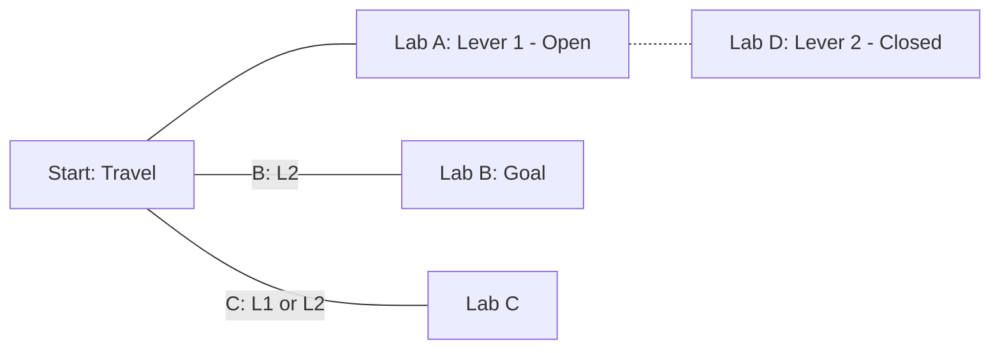

```mermaid
graph LR
    Start[Start: Travel] --- A[Lab A: Lever 1 - Open]
    Start ---|B: L2| B[Lab B: Goal]
    Start ---|C: L1 or L2| C[Lab C]
    A -.- D[Lab D: Lever 2 - Closed]
```

Solution:
* Observe Lab C is open without observing Lab B is closed
* Travel to T-1
* Switch L1 to Closed
* Travel to T0
  * This forces the unobserved L2 to become open
* Go to Lab B