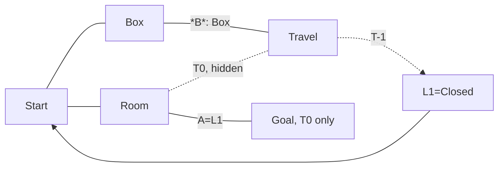

Incorrect solution:

- Box -> B (in doing so, observe start location is Box room, not door B)
- Travel -> T-1
- L1 -> Open
- Try go to goal, no present in T-1
- Try Box -> B and Travel -> T0, but can't because then Box's starting position would be door B

Solution:

- Avoid observing Box
- Take hidden passage to Travel -> T-1
- L1 -> Open
- Box -> B
- Travel -> T0
- Go to goal
