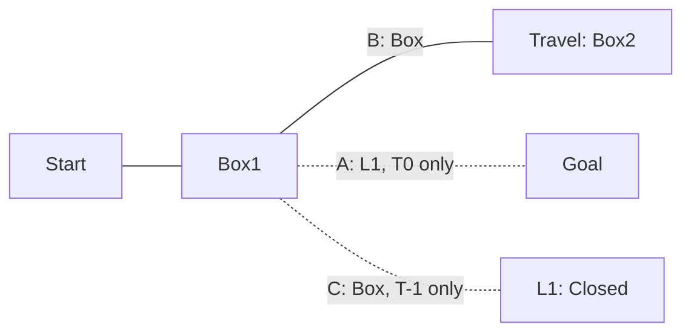

Solution:

- Don't check that A is locked
- Box1 -> B
- Travel to T-1
- Box2 -> B
- Box1 -> C
- L1 -> Open
- Box1 -> Box room (required reset)
- Box2 -> Travel room (required reset)
- Travel T0
- Goal
