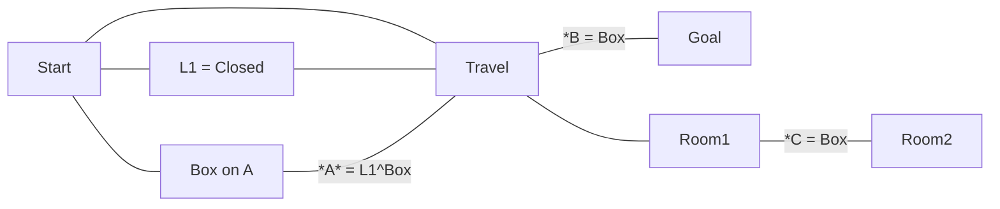

Solution:

- Don't observe box's location
- Observe no box in Travel room or Room1
- Observe A is locked
- Travel to T-1
- Switch L1 to Open
- Travel to T0
- A must still be locked, but L1 is Open, so Box must not be in Box room\*, and therefore must be in the Goal room\*\* and B is Open
- Travel to goal

\*Note: need to make some way such that the only way it could be in that room is in a place it would open the door.

\*\*Also need some reason it can't just be in an arbitrary location or non-existent
