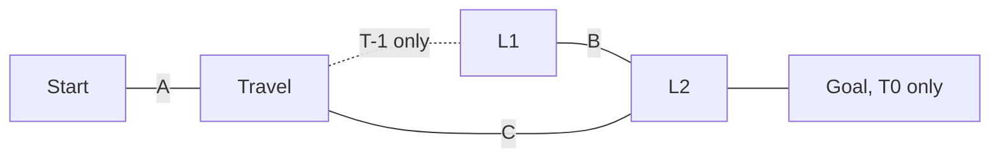

```mermaid
graph LR
    Start ---|A| Travel
    Travel -.-|T-1 only| L1
    L1 ---|B| L2
    L2 ---|C| Travel
    L2 --- G[Goal, T0 only]

```

Levers:
* L1 = Open
* L2 = Closed

Doors:
* A = L1
* B = !(L1 || L2)
* C = L2

Solution:
* Observe A = Open
* Travel to T-1
* Set L1 = Closed
* Go to B
* Set L2 = Open
* Go to C
* 