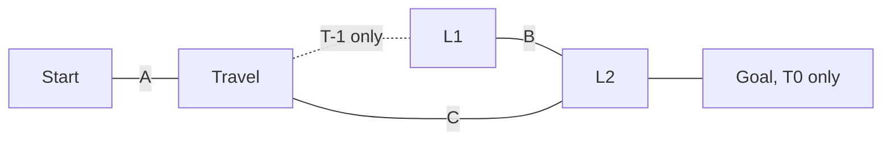

Levers:
* L1 = Open
* L2 = Closed

Doors:
* A = L1
* B = !(L1 || L2)
* C = L2

Solution:
* Go to Travel room
    * Observe A = Open
    * Don't observe C = Closed
* Travel to T-1
* Go to L1
    * Set L1 = Closed
    * B becomes open because L2 defaults to closed
* Go to L2
    * Could check Goal room, but it's empty at T-1
    * Set L2 = Open
    * B becomes closed, and C becomes open
* Go to the Travel room
* Go to L1
    * Set L1 = Open
    * Removes the contradiction, since you observed A = Open at T0
* Go to the Travel room
    * Travel to T0
    * State is both L1 = Open and L2 = Open
* Go to L2
* Go to Goal