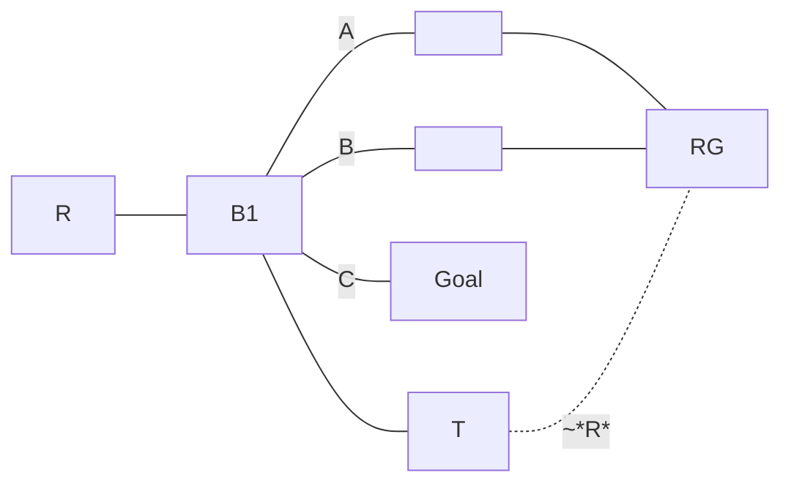

```mermaid
graph LR
    R --- B1
    B1 ---|A| A[ ]
    B1 ---|B| B[ ]
    B1 ---|C| Goal
    B1 --- T
    A --- RG
    B --- RG
    T -.-|~*R*| RG

```

Buttons:
* B1: Off

Doors:
* A-C: B1 && random

Observables:
* RG: B1 && (A || B)

Solution:
* Observe ~RG
* Travel to T-1
* Press B1 --> C opens
* Goal