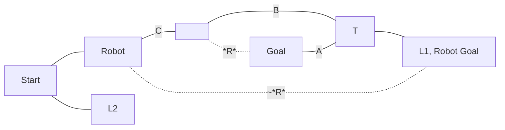

Levers:
* L1 = Closed
* L2 = Open

Doors:
* A = Closed (Mutable, not Derived)
* B = L2
* C = L1
* R = Robot only
* ~R = No Robot

Other Vars:
* RG = C && (A || B)

Assumptions:
* The robot goes home after it does its business
* The action it performs does not persist between timelines