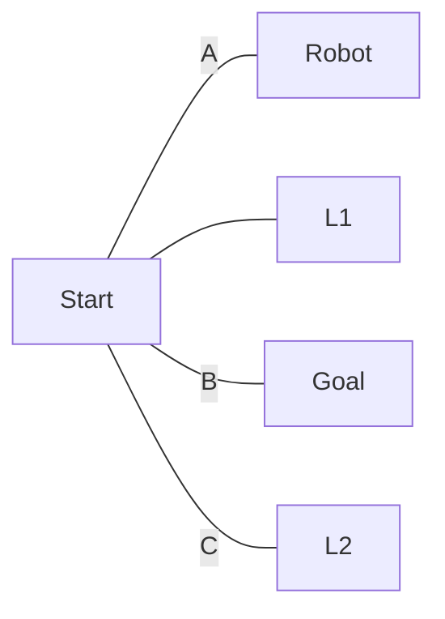

```mermaid
graph LR
    Start ---|A| Robot
    Start --- L1
    Start ---|B| Goal
    Start ---|C| L2
```

Levers:
* L1 = Open
* L2 = Closed

Doors:
* A = !L1
* B = L1 && L2
* C = Robot

Solution:
* Go to L1 --> Off
  * Robot repairs C
* Go to L2 --> On
* Go to L1 --> On
* Go to G